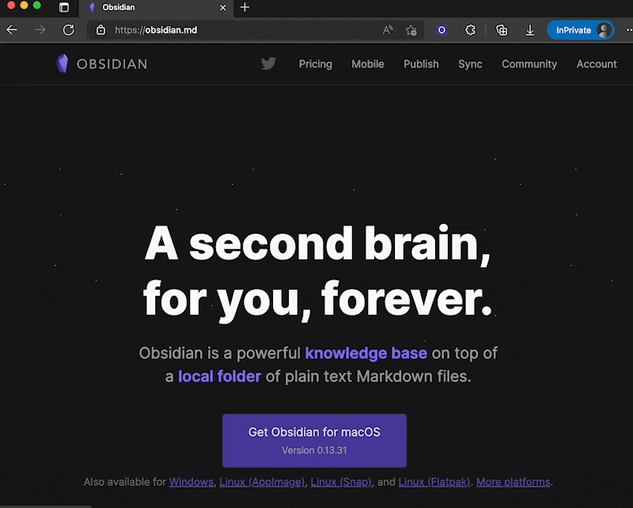

# A Obsidian Web Clipper
## Screenshot

## Dependency 
- [Obsidian](https://obsidian.md/)
- [obsidian-advanced-uri](https://github.com/Vinzent03/obsidian-advanced-uri)

## Installing 

1. Download/clone this repository
2. Navigate to the [Chrome Extension](chrome://extensions) and enabled developer mode (top right of your window)
3. Load unpacked extension and navigate to the folder you just cloned 
4. Chrome will now build the extension and you can use the extension menu to pin in to the user interface.
5. Try it

## Configuation
like `obsidian://advanced-uri?vault=demo&daily=true&mode=append&data={note}`